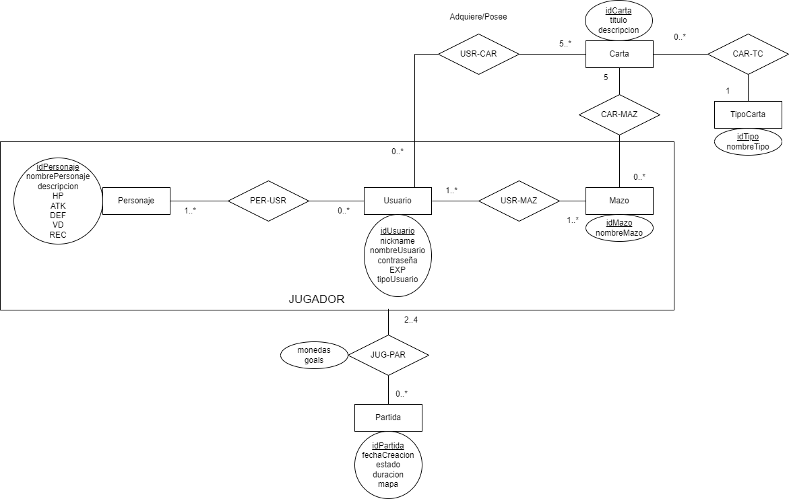

# Propuesta de TP DSW

## Grupo

### Integrantes

- 49500 Faulin, Eugenio Pandu
- 49741 Romero, Alan Matias
- 49639 Russmann, Octavio Thomas

### Repositorio

- https://github.com/pandugat/TP-DSW-Faulin-Romero-Russmann

## Tema

### Descripcion

Juego de mesa por turnos, en el cual los jugadores se van moviendo por las casillas
consiguiendo monedas, y victorias por medio de batallas. El objetivo de los jugadores es
cumplir misiones para alcanzar el nivel máximo, el primero que lo logre gana la partida. En
el comienzo, todos los jugadores tienen la misión de conseguir X cantidad de monedas,
estas se pueden usar para activar cartas. Al cumplir la misión, el jugador deberá caer en
una casilla de hogar para cumplirla, subiendo de nivel y consiguiendo otra misión
eligiendo entre conseguir X cantidad de victorias o X cantidad de monedas.

### Modelo

    

## Alcance Funcional

### Alcance Minimo

- Regularidad:

| Req                | Detalle                                                                                                                                                                       |
| ------------------ | ----------------------------------------------------------------------------------------------------------------------------------------------------------------------------- |
| CRUD Simple        | 1. CRUD Tipo Carta   2. CRUD Personaje   3. CRUD Usuario                                                                                                                |
| CRUD Dependiente   | 1. CRUD Carta ==\> CRUD Tipo Carta   2. CRUD Mazo ==\> CRUD Carta   3. CRUD Jugador ==\> (CRUD Mazo/CRUD Personaje/CRUD Usuario)   4. CRUD Partida ==\> CRUD Jugador |
| Listado \+ detalle | 1. Listado de cartas dado un determinado tipo de cartas   2. Listado de Partidas por usuarios, estado de la partida, fecha de creacion                                     |
| CUU/Epic           | 1. Crear Usuario   2. Unirse a Partida   3. Selecionar Personaje                                                                                                        |

- Aprobacion Directa

| Req      | Detalle                                                                                                                                       |
| -------- | --------------------------------------------------------------------------------------------------------------------------------------------- |
| CRUD     | 1. CRUD Tipo Carta   2. CRUD Personaje   3. CRUD Usuario   4. CRUD Carta   5. CRUD Mazo   6. CRUD Jugador   7. CRUD Partida |
| CUU/Epic | 1. Crear Usuario   2. Unirse a Partida   3. Selecionar Personaje   4. Crear Mazo   5. Crear Partida   6. Modificar Usuario     |
